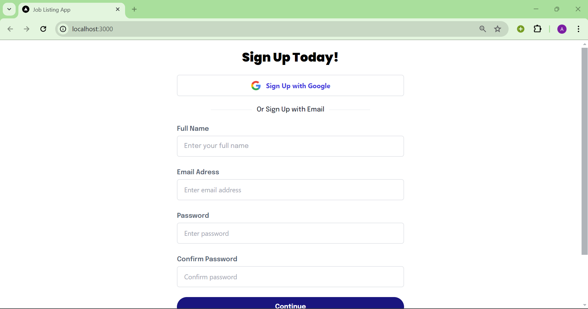
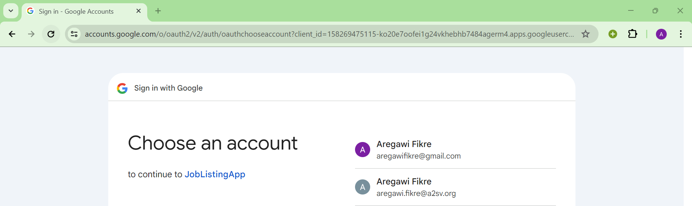
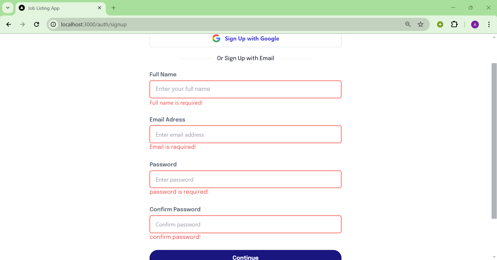
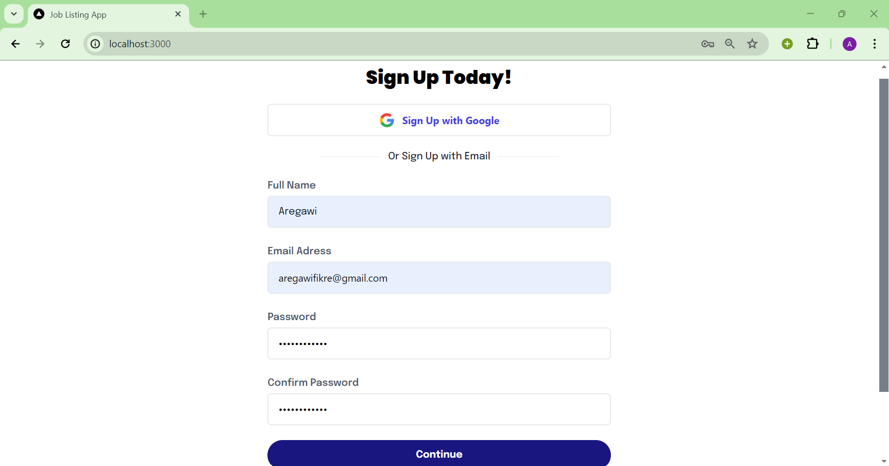
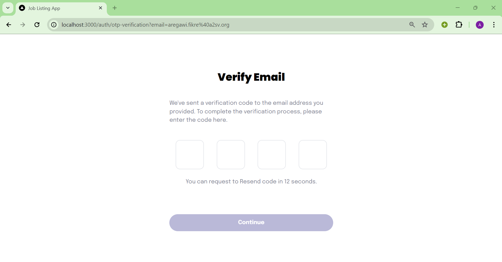
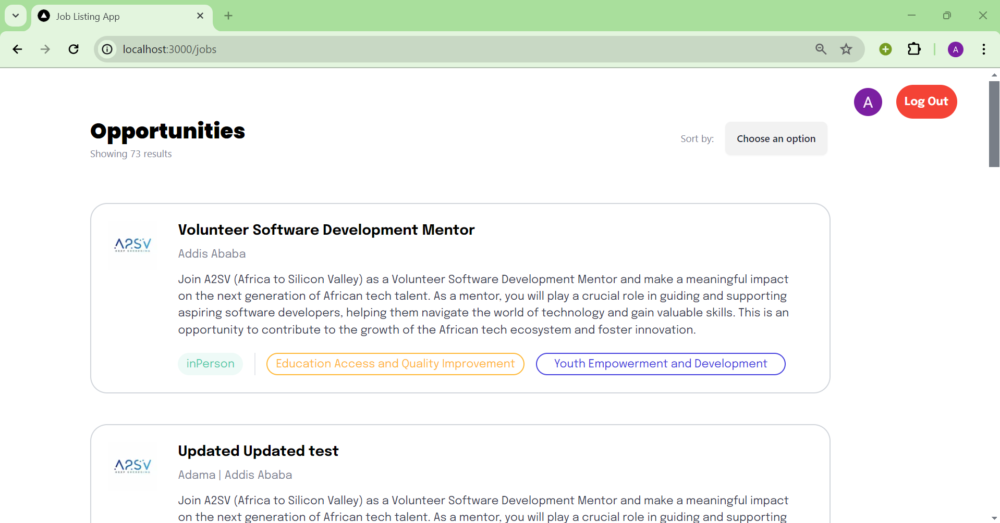
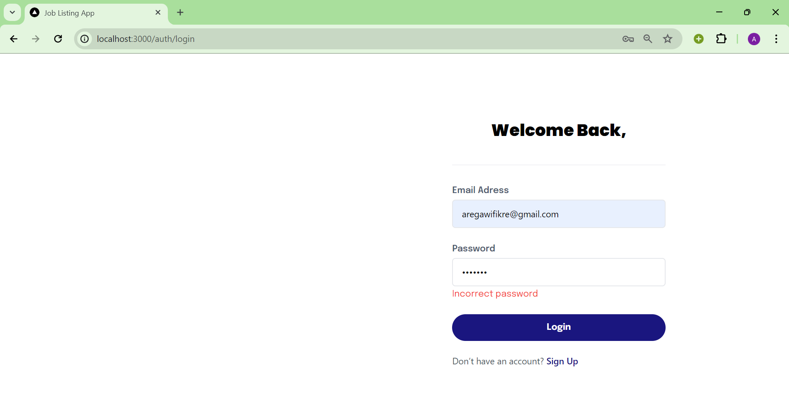

# Job_Listing_app_with_auth
This is a job listing application.

## Signing in with google
When the page loads initially you will see the following signup page.



From here you can sign up using google or by filling out the form.







If you want to sign in by filling out the form a verification code will be sent to your email.



when you successfully sign up you will be redirected to the page for the job list.



If you already have an account you can login through the login page.



After you logged in this page will be shown.


Incase you want to logout from the application you can do so by clicking the logout button on the top corner.


## To launch the website
You should have node installed.
Clone the repository and install dependencies by running the following commands:
```bash
git clone https://github.com/AregawiF/Job_Listing_app_with_auth.git
cd Job_Listing_app_with_auth
npm install
npm run dev
''' then follow the link to launch the website.
